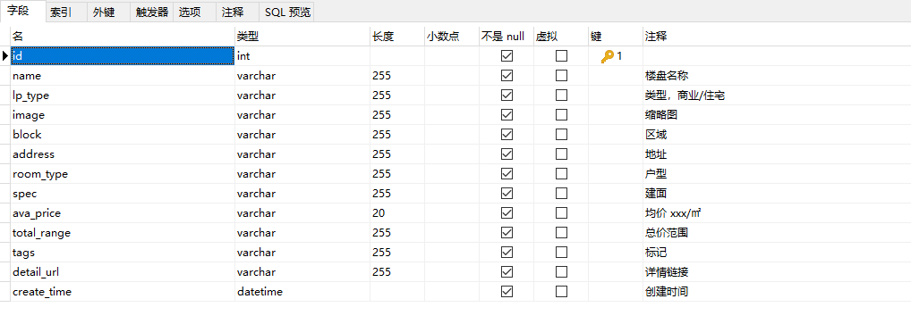
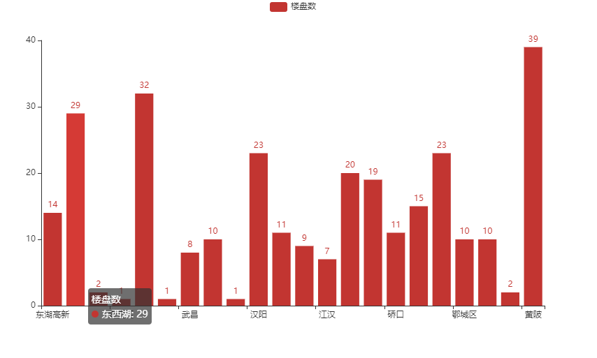

# Spider_Beike 

Spider for beike(贝壳) used by Scrapy and a simple data analyse code which is used by pandas and pyecharts.
Just for fun and learning.

# 使用Scrapy采集贝壳找房楼盘数据
通过scrapy将贝壳页面数据采集到mysql存储，通过pandas以及pyecharts做简单的分析和可视化

采集的字段

生成的图表
